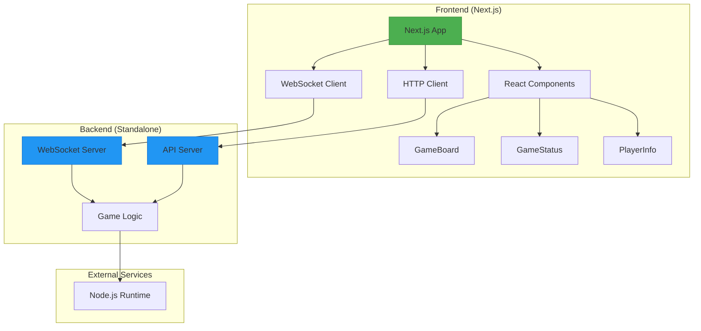

# Frontend-Backend Separation Design

## 1. Overview

This design document outlines the refactoring of the Tic-Tac-Toe application to establish a clear separation between frontend and backend components, and to simplify the startup process. Currently, the application uses a hybrid approach with both App Router and Pages API, and the WebSocket server is embedded within the Next.js application.

The refactoring will:
1. Clearly separate frontend and backend codebases
2. Simplify the startup process with clear, documented commands
3. Improve maintainability and scalability
4. Enable independent deployment of frontend and backend services

## 2. Current Architecture

### 2.1 Project Structure
```
tic-tac-toe/
├── src/
│   ├── app/                 # Next.js App Router (Frontend)
│   │   ├── api/             # App Router API endpoints
│   │   ├── multiplayer/     # Multiplayer game page
│   │   ├── vs-cpu/          # Single-player game page
│   │   ├── page.tsx         # Home page
│   │   └── layout.tsx       # Root layout
│   ├── components/          # Reusable UI components
│   ├── pages/               # Legacy Pages API (Backend)
│   │   └── api/
│   │       └── websocket.ts # WebSocket server
│   └── utils/               # Shared game logic
├── package.json             # Dependencies and scripts
└── next.config.ts           # Next.js configuration
```

### 2.2 Current Startup Process
Currently, the application requires two separate commands to run:
1. `npm run dev` - Starts the Next.js frontend on port 3000
2. `npx tsx src/pages/api/websocket.ts` - Starts the WebSocket server on port 8080

This creates confusion for developers and complicates the deployment process.

## 3. Proposed Architecture

### 3.1 New Project Structure
```
tic-tac-toe/
├── frontend/                # Next.js frontend application
│   ├── app/                 # App Router pages and components
│   │   ├── api/             # App Router API endpoints
│   │   ├── multiplayer/     # Multiplayer game page
│   │   ├── vs-cpu/          # Single-player game page
│   │   ├── page.tsx         # Home page
│   │   └── layout.tsx       # Root layout
│   ├── components/          # Reusable UI components
│   ├── utils/               # Frontend utilities
│   ├── package.json         # Frontend dependencies
│   └── next.config.ts       # Next.js configuration
├── backend/                 # Standalone WebSocket server
│   ├── src/                 # Backend source code
│   │   ├── server.ts        # WebSocket server implementation
│   │   ├── gameLogic.ts     # Server-side game logic
│   │   └── types.ts         # Shared types
│   ├── package.json         # Backend dependencies
│   └── tsconfig.json        # TypeScript configuration
├── shared/                  # Shared code between frontend and backend
│   └── types/               # Shared TypeScript types
├── package.json             # Root package.json with workspace commands
└── README.md                # Project documentation
```

### 3.2 Architecture Diagram


## 4. Refactored Components

### 4.1 Frontend Separation
The frontend will be contained entirely within the `frontend/` directory:
- All React components and Next.js pages will remain in the `frontend/app/` directory
- Frontend-specific utilities will be moved to `frontend/utils/`
- The frontend will communicate with the backend via WebSocket for multiplayer functionality
- HTTP API calls will be used for other backend services

### 4.2 Backend Separation
The backend will be a standalone service in the `backend/` directory:
- WebSocket server implementation will be moved from `src/pages/api/websocket.ts` to `backend/src/server.ts`
- Backend-specific game logic will be moved to `backend/src/gameLogic.ts`
- The backend will be a standalone Node.js application that can be deployed independently

### 4.3 Shared Code
Common types and interfaces will be moved to a `shared/` directory:
- Game state types
- Player types
- Message format types
- Any other shared interfaces between frontend and backend

## 5. Simplified Startup Process

### 5.1 Development Environment
The refactored application will have simplified startup commands using npm workspaces:

1. **Install all dependencies**:
   ```bash
   npm install
   ```

2. **Start both frontend and backend in development mode**:
   ```bash
   npm run dev
   ```

3. **Start only frontend**:
   ```bash
   npm run dev:frontend
   ```

4. **Start only backend**:
   ```bash
   npm run dev:backend
   ```

### 5.2 Production Environment
For production deployment:

1. **Build frontend**:
   ```bash
   npm run build:frontend
   ```

2. **Start frontend**:
   ```bash
   npm run start:frontend
   ```

3. **Start backend**:
   ```bash
   npm run start:backend
   ```

### 5.3 Package.json Scripts
The root `package.json` will contain workspace scripts:
```json
{
  "name": "tic-tac-toe",
  "private": true,
  "workspaces": [
    "frontend",
    "backend"
  ],
  "scripts": {
    "dev": "concurrently \"npm run dev:frontend\" \"npm run dev:backend\"",
    "dev:frontend": "npm run dev -w frontend",
    "dev:backend": "npm run dev -w backend",
    "build:frontend": "npm run build -w frontend",
    "start:frontend": "npm run start -w frontend",
    "start:backend": "npm run start -w backend"
  },
  "devDependencies": {
    "concurrently": "^7.6.0"
  }
}
```

## 6. Implementation Plan

### 6.1 Phase 1: Project Restructuring
1. Create `frontend/`, `backend/`, and `shared/` directories
2. Move frontend code to `frontend/` directory
3. Move backend code to `backend/` directory
4. Create shared types in `shared/` directory
5. Update import paths throughout the codebase

### 6.2 Phase 2: Dependency Management
1. Create separate `package.json` files for frontend and backend
2. Move dependencies to appropriate `package.json` files
3. Configure npm workspaces in root `package.json`
4. Update build and start scripts

### 6.3 Phase 3: Configuration Updates
1. Update TypeScript configurations for each workspace
2. Update Next.js configuration
3. Update Jest configuration for testing
4. Update ESLint configuration

### 6.4 Phase 4: Testing and Validation
1. Verify that all components work as expected
2. Test multiplayer functionality
3. Test single-player functionality
4. Validate build processes
5. Update documentation

## 7. Benefits of Refactoring

### 7.1 Clear Separation of Concerns
- Frontend and backend code are completely separated
- Each component can be developed and tested independently
- Easier to understand project structure for new developers

### 7.2 Simplified Development Process
- Single command to start both frontend and backend in development
- Clear documentation of available scripts
- Reduced cognitive load for developers

### 7.3 Improved Deployment Flexibility
- Frontend can be deployed to static hosting services (Vercel, Netlify)
- Backend can be deployed to server environments or containerized
- Independent scaling of frontend and backend services

### 7.4 Better Maintainability
- Clear boundaries between frontend and backend logic
- Shared types ensure consistency between client and server
- Easier to implement new features without affecting other components

## 8. Migration Steps

### 8.1 Directory Restructuring
1. Create the new directory structure:
   ```bash
   mkdir frontend backend shared
   ```

2. Move frontend files:
   ```bash
   mv src/app frontend/app
   mv src/components frontend/components
   mv src/utils frontend/utils
   ```

3. Move backend files:
   ```bash
   mkdir backend/src
   mv src/pages/api/websocket.ts backend/src/server.ts
   ```

4. Create shared types:
   ```bash
   mkdir shared/types
   ```

### 8.2 Code Modifications
1. Update import paths in all files to reflect new structure
2. Move shared types to the `shared/` directory
3. Update WebSocket client connection URLs in frontend
4. Update server port configuration

### 8.3 Configuration Updates
1. Create `frontend/package.json` and `backend/package.json`
2. Update root `package.json` with workspace configuration
3. Create separate TypeScript configurations for each workspace
4. Update Next.js configuration if needed

### 8.4 Testing
1. Run all existing tests to ensure functionality is preserved
2. Add new tests for any modified components
3. Test the new startup process
4. Verify multiplayer functionality works correctly