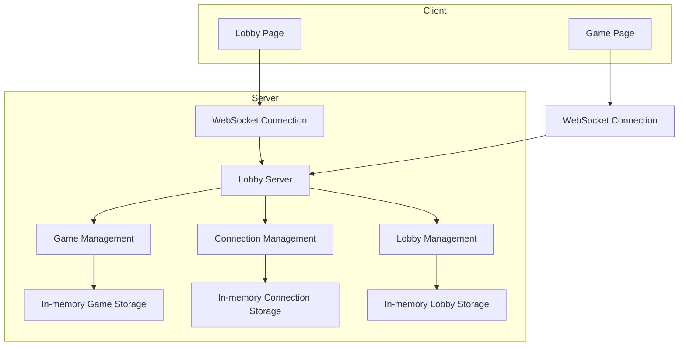
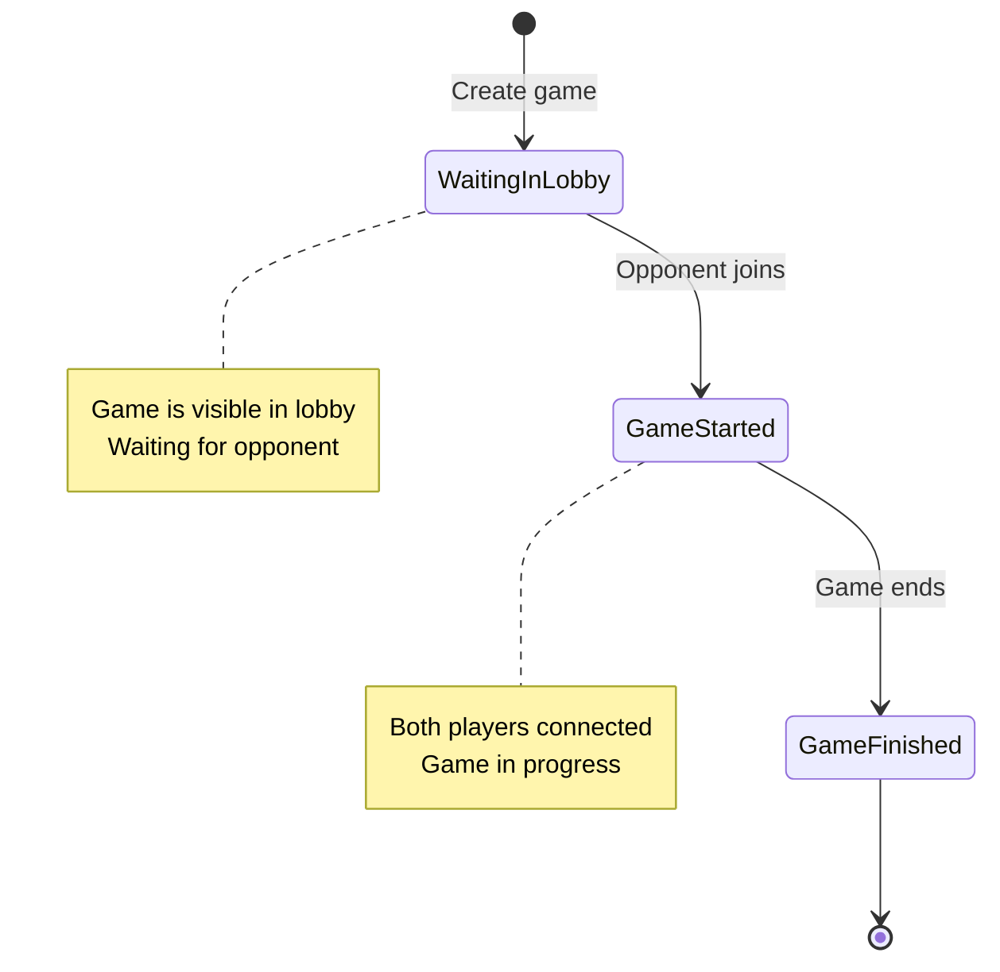
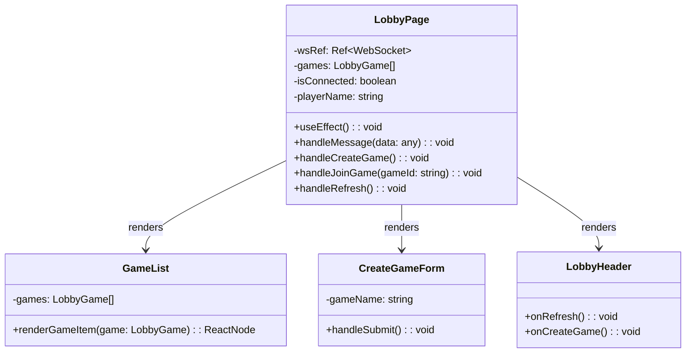
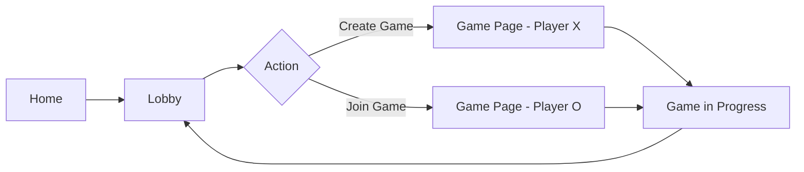

# Game Lobby System Design

## Overview
This document outlines the design for implementing a game lobby system in the Tic-Tac-Toe multiplayer application. The lobby will allow users to create games, browse available games, and join existing games using a Game ID. This enhancement will improve the user experience by providing a centralized place for players to find and join multiplayer games.

## Architecture

### Current System
The current multiplayer system uses WebSockets for real-time communication between players. Players generate a random game ID and share it with their opponent, who then joins the same game. The system uses in-memory storage to manage games, connections, and player associations.

### Proposed Lobby System
The lobby system will extend the existing WebSocket server to include lobby functionality. The key components include:

1. **Lobby Management** - Server-side component to track available games
2. **Game Discovery** - Mechanism for players to browse available games
3. **Game Creation** - Interface for creating new games in the lobby
4. **Game Joining** - Interface for joining existing games via Game ID



## API Endpoints Reference

### WebSocket Message Types (New)
| Message Type | Direction | Purpose |
|--------------|-----------|---------|
| `CREATE_GAME` | Client → Server | Request to create a new game in the lobby |
| `LIST_GAMES` | Client → Server | Request for list of available games |
| `JOIN_LOBBY_GAME` | Client → Server | Request to join a game from the lobby |
| `LOBBY_UPDATE` | Server → Client | Broadcast lobby state updates |
| `GAME_CREATED` | Server → Client | Confirmation of game creation |

### WebSocket Message Schemas

#### CREATE_GAME
```json
{
  "type": "CREATE_GAME",
  "payload": {
    "playerName": "string",
    "gameName": "string" // Optional friendly name for the game
  }
}
```

#### LIST_GAMES
```json
{
  "type": "LIST_GAMES",
  "payload": {}
}
```

#### JOIN_LOBBY_GAME
```json
{
  "type": "JOIN_LOBBY_GAME",
  "payload": {
    "gameId": "string",
    "playerName": "string"
  }
}
```

#### LOBBY_UPDATE
```json
{
  "type": "LOBBY_UPDATE",
  "payload": {
    "games": [
      {
        "id": "string",
        "name": "string",
        "playerCount": "number",
        "maxPlayers": 2,
        "status": "WAITING_FOR_OPPONENT"
      }
    ]
  }
}
```

#### GAME_CREATED
```json
{
  "type": "GAME_CREATED",
  "payload": {
    "gameId": "string",
    "playerRole": "X",
    "game": {
      "id": "string",
      "board": "Board",
      "currentPlayer": "Player",
      "players": {
        "X": { "name": "string" },
        "O": null
      },
      "status": "WAITING_FOR_OPPONENT",
      "winner": null
    }
  }
}
```

## Data Models & Extensions

### Lobby Game Model
Extends the existing Game model with lobby-specific information:

```typescript
interface LobbyGame {
  id: string;
  name: string; // Friendly name for the game
  playerCount: number;
  maxPlayers: number;
  status: 'WAITING_FOR_OPPONENT';
  createdAt: Date;
  createdBy: string; // Player name who created the game
}
```

### Updated Game Model
The existing Game model will be extended to include optional name field:

```typescript
interface Game {
  id: string;
  name?: string; // Optional friendly name
  board: Board;
  currentPlayer: Player;
  players: {
    X: { id: string; name: string } | null;
    O: { id: string; name: string } | null;
  };
  status: GameStatus;
  winner: Player | null;
}
```

## Business Logic Layer

### Lobby Management
1. **Game Creation**
   - When a player creates a game via the lobby, the server:
     - Generates a unique game ID
     - Creates a new game entry in the lobby
     - Adds the creating player as player X
     - Broadcasts lobby update to all connected lobby clients

2. **Game Listing**
   - Server maintains a list of available games (those waiting for opponent)
   - When a client requests the list, server sends current lobby state
   - Lobby automatically updates when games become full or are abandoned

3. **Game Joining**
   - When a player joins a game from the lobby:
     - Server validates the game exists and is available
     - Assigns the player to the O position
     - Removes the game from the lobby
     - Notifies both players to transition to the game page

### State Transitions


## Frontend Component Architecture

### Lobby Page Component
A new page component will be created to handle the lobby functionality:



### Component Hierarchy
```
LobbyPage
├── LobbyHeader
├── CreateGameForm
├── GameList
│   └── GameItem
└── ConnectionStatus
```

### Props and State Management
- **LobbyPage State**:
  - `games`: List of available games from lobby
  - `isConnected`: WebSocket connection status
  - `playerName`: Current player's name
- **GameList Props**:
  - `games`: Array of lobby games
  - `onJoinGame`: Function to join a game
- **CreateGameForm Props**:
  - `onCreateGame`: Function to create a new game

## Routing & Navigation

### New Routes
- `/lobby` - Lobby page for creating/joining games
- Current `/multiplayer` route will still be used for active games

### Navigation Flow


## Styling Strategy
- Use existing Tailwind CSS classes for consistency
- Follow the current color scheme and design patterns
- Responsive design for different screen sizes
- Clear visual distinction between available games
- Intuitive form elements for game creation

## State Management
- WebSocket connection state managed with React hooks
- Lobby game list stored in component state
- Player name stored in localStorage (consistent with existing implementation)
- No additional state management library needed for this feature

## API Integration Layer
- Extend existing WebSocket client implementation
- Add new message handlers for lobby-specific messages
- Maintain existing game message handlers for backward compatibility
- Reuse connection management logic from current multiplayer implementation

## Testing Strategy

### Unit Tests
1. **Server-side tests**:
   - Lobby game creation
   - Game listing functionality
   - Game joining logic
   - Lobby state updates

2. **Client-side tests**:
   - Lobby page component rendering
   - WebSocket message handling
   - Game list display
   - Form validation

### Integration Tests
1. End-to-end lobby flow:
   - Creating a game in the lobby
   - Listing available games
   - Joining a game from the lobby
   - Transitioning to game page

### Test Scenarios
- Multiple players viewing the same lobby
- Creating games with various names
- Joining non-existent games
- Joining full games
- Network disconnection handling