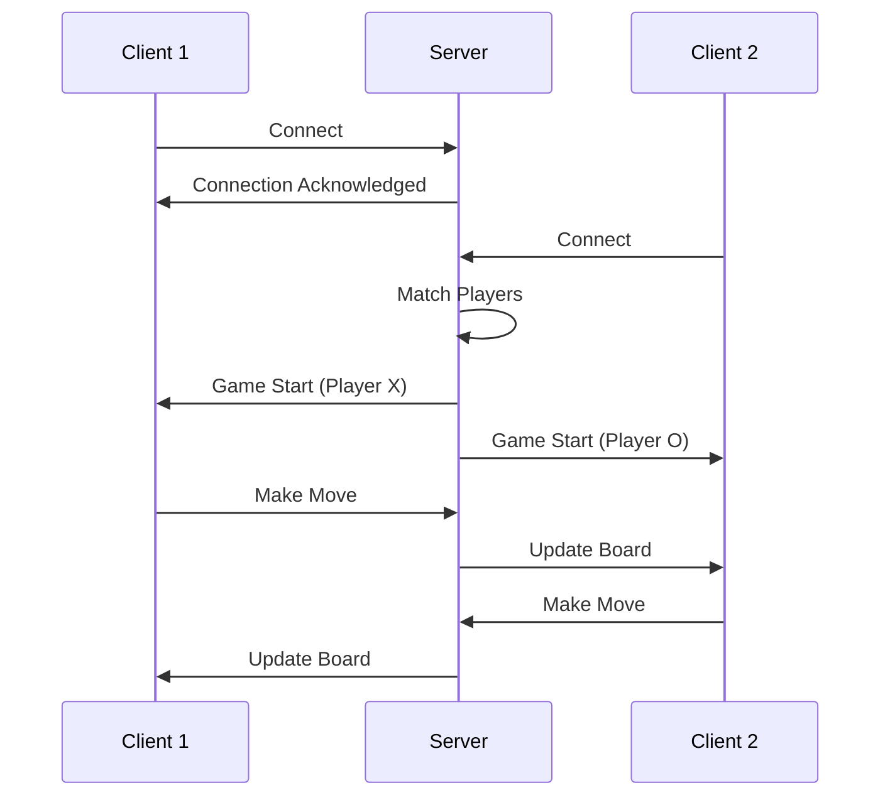
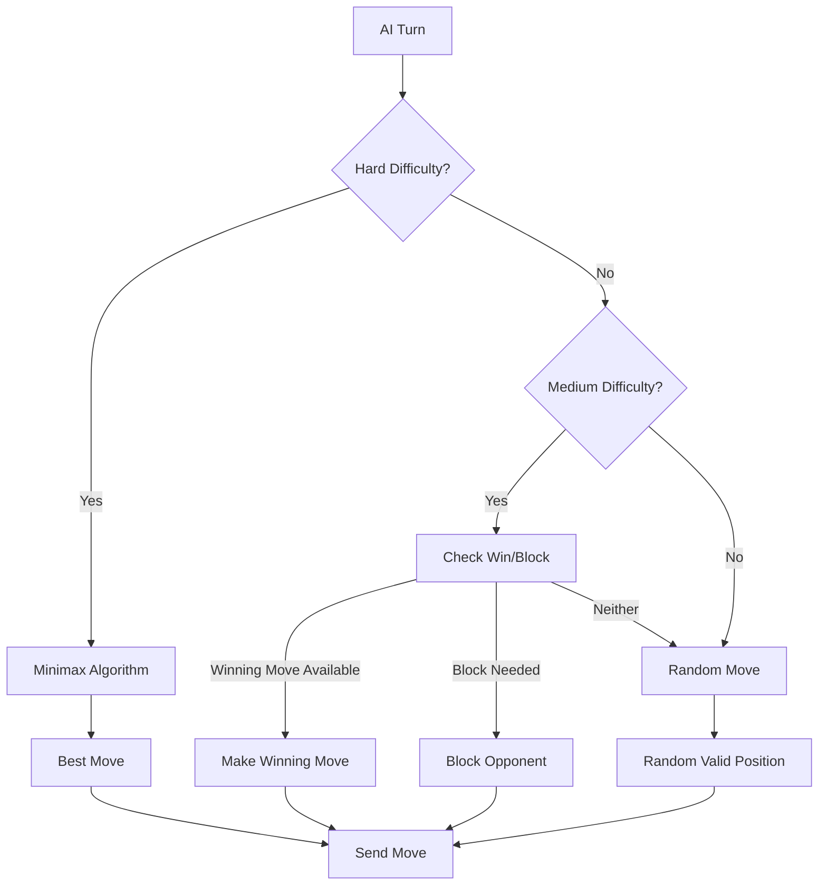
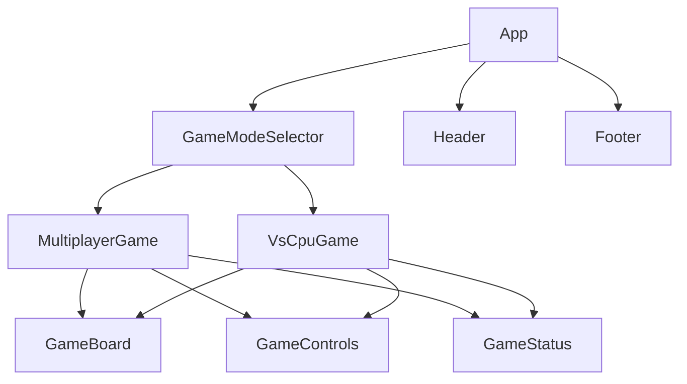

# Tic-Tac-Toe Multiplayer Game Design

## 1. Overview

This document outlines the design for a Tic-Tac-Toe (OX) game that supports both multiplayer network play and single-player mode against a CPU opponent. The game will be implemented with a client-server architecture to facilitate real-time gameplay between two players over a network.

## 2. Architecture

### 2.1 System Components

```
┌─────────────────┐         ┌──────────────────┐         ┌─────────────────┐
│   Player 1      │         │     Server       │         │   Player 2      │
│   (Client)      │◄───────►│   (Game Logic)   │◄───────►│   (Client)      │
└─────────────────┘         └──────────────────┘         └─────────────────┘
         │                            │                            │
         │                            │                            │
         ▼                            ▼                            ▼
┌─────────────────┐         ┌──────────────────┐         ┌─────────────────┐
│   Local CPU     │         │   Game State     │         │   Local CPU     │
│   (AI Logic)    │◄───────►│   Management     │◄───────►│   (AI Logic)    │
└─────────────────┘         └──────────────────┘         └─────────────────┘
```

### 2.2 Technology Stack

- **Frontend**: Next.js with React for server-side rendering and client-side interactivity
- **Backend**: Node.js with WebSocket for real-time communication
- **Networking**: WebSocket protocol for real-time gameplay
- **Game State Management**: In-memory storage with potential for database persistence

## 3. Game Features

### 3.1 Multiplayer Network Play
- Real-time gameplay between two players over network
- Player authentication and session management
- Matchmaking system
- Game state synchronization

### 3.2 Single Player vs CPU
- Three difficulty levels for CPU opponent (Easy, Medium, Hard)
- Local gameplay without network connection
- AI decision-making algorithms

### 3.3 Common Features
- Game board visualization
- Win/loss/draw detection
- Turn management
- Score tracking
- Responsive UI for different screen sizes

## 4. Game Logic

### 4.1 Board Representation
```
 0 | 1 | 2 
-----------
 3 | 4 | 5 
-----------
 6 | 7 | 8 
```

The game board will be represented as an array of 9 positions, numbered 0-8.

### 4.2 Game States
- WAITING_FOR_OPPONENT: Waiting for another player to join
- PLAYER_X_TURN: Player X's turn
- PLAYER_O_TURN: Player O's turn
- PLAYER_X_WON: Player X has won
- PLAYER_O_WON: Player O has won
- DRAW: Game ended in a draw

### 4.3 Win Conditions
A player wins by placing three of their marks in:
- A horizontal row
- A vertical column
- A diagonal line

## 5. Network Architecture

### 5.1 Connection Flow


### 5.2 Message Protocol
All communication between clients and server will use JSON messages with the following structure:

```json
{
  "type": "message_type",
  "payload": {}
}
```

Message Types:
- `JOIN_GAME`: Player requests to join a game
- `GAME_START`: Game has started with assigned player symbols
- `MOVE_MADE`: A player has made a move
- `GAME_UPDATE`: Game state update
- `GAME_OVER`: Game has ended
- `PLAYER_DISCONNECTED`: A player has disconnected

## 6. CPU AI Implementation

### 6.1 Difficulty Levels

#### Easy
- Makes random valid moves
- No strategic consideration

#### Medium
- Blocks opponent's winning moves
- Makes winning moves when available
- Otherwise makes random moves

#### Hard
- Implements minimax algorithm with alpha-beta pruning
- Optimal play with no possibility of losing
- Always makes the best possible move

### 6.2 AI Decision Process


## 7. Data Models

### 7.1 Game State
```javascript
{
  id: string,              // Unique game identifier
  board: Array(9),         // Current board state
  currentPlayer: 'X'|'O',  // Whose turn it is
  status: string,          // Current game status
  players: {
    X: { id: string, name: string },
    O: { id: string, name: string }
  },
  winner: 'X'|'O'|null,    // Winner of the game
  createdAt: timestamp,    // When the game started
  updatedAt: timestamp     // Last update timestamp
}
```

### 7.2 Player Session
```javascript
{
  id: string,              // Unique player identifier
  name: string,            // Player name
  sessionId: string,       // Session identifier
  connected: boolean,      // Connection status
  wins: number,            // Number of wins
  losses: number,          // Number of losses
  draws: number            // Number of draws
}
```

## 8. API Endpoints

### 8.1 WebSocket Events

#### Client to Server
- `join`: Player joins a game
- `move`: Player makes a move
- `disconnect`: Player disconnects

#### Server to Client
- `gameStart`: Game has started
- `moveMade`: A move has been made
- `gameUpdate`: Game state update
- `gameOver`: Game has ended
- `error`: An error occurred

## 9. UI Components

### 9.1 Game Board
- 3x3 grid for placing X and O marks
- Visual indication of current player's turn
- Highlighting of winning combination

### 9.2 Game Controls
- New game button
- Difficulty selector (for CPU mode)
- Player name inputs
- Score display

### 9.3 Game Status
- Current player indicator
- Game result display
- Connection status

## 10. Next.js Implementation Details

### 10.1 Project Structure
```
src/
├── components/
│   ├── GameBoard.tsx
│   ├── GameControls.tsx
│   ├── GameStatus.tsx
│   └── PlayerInfo.tsx
├── pages/
│   ├── api/
│   ├── _app.tsx
│   ├── index.tsx
│   ├── multiplayer.tsx
│   └── vs-cpu.tsx
├── styles/
│   └── globals.css
└── utils/
    ├── gameLogic.ts
    └── aiLogic.ts
```

### 10.2 Key Next.js Features Utilized
- **Server-Side Rendering (SSR)**: For initial game state loading
- **Static Site Generation (SSG)**: For static pages like rules and about
- **API Routes**: For handling game initialization and user authentication
- **Dynamic Routing**: For different game modes (multiplayer vs CPU)
- **Image Optimization**: For game assets and player avatars
- **Built-in CSS Support**: For styling components

### 10.3 Component Hierarchy


## 11. Testing Strategy

### 11.1 Unit Tests
- Game logic validation
- Win condition detection
- AI decision making
- Network message handling

### 11.2 Integration Tests
- End-to-end gameplay
- Network communication
- Player disconnection handling

### 11.3 Next.js Component Tests
- React component rendering tests using Jest and React Testing Library
- Snapshot testing for UI components
- Mocking WebSocket connections for component testing
- Testing server-side rendering functions

### 11.4 End-to-End Tests
- Cypress or Playwright tests for full user flows
- Testing both multiplayer and CPU modes
- Network simulation for multiplayer testing

### 11.5 User Acceptance Tests
- UI responsiveness
- Game flow validation
- Multiplayer synchronization